# AI Trading System

An academic project focused on the design of an intelligent investment support system that combines multi--agent analysis, a FINMEM--inspired adaptive memory structure, a FINCON--style parallel agent organization, a Markov Decision Process (MDP) decision layer, and an interactive interface for structured financial reasoning.

**Authors:** Daniel Rodríguez Calderón, Pablo Maestro Fernández  
**Project Type:** Academic / Portfolio Showcase  
**Status:** Private core implementation, public conceptual presentation

## Overview

This repository presents the conceptual design, interface, and system architecture of an AI--driven trading and investment analysis platform. The project was developed to explore how specialized analytical modules can collaborate within a unified workflow to generate structured financial insights and support investment interpretation.

The system combines user profiling, evaluator reasoning, risk analysis, market interpretation, a FINMEM--inspired memory structure, a FINCON-style parallel agent organization, and an MDP--based decision layer. The purpose of this public repository is not to expose the private implementation, but to document the overall design approach, the architectural structure, and the user--facing dashboard in a clear and professional format.

## Objective

The project was created to study how an intelligent financial system can integrate parallel agent reasoning, adaptive memory, and formal decision modeling in a single environment. Its main objective is to transform complex financial information into organized, explainable, and more interpretable outputs for the user.

In practical terms, the system was designed to:

- Organize financial analysis into specialized modules.
- Combine qualitative and quantitative reasoning.
- Incorporate user profiling into the interpretation of recommendations.
- Use a FINMEM--inspired memory structure to preserve relevant analytical context across cycles.
- Apply a FINCON--style parallel agent organization to process complementary financial perspectives simultaneously.
- Use a Markov Decision Process (MDP) layer to formalize decision support.
- Present financial outputs through an interactive dashboard that is more readable than isolated technical signals.

## System Architecture

The platform follows a modular architecture in which an interactive front--end communicates with a graph--based orchestration layer that coordinates several specialized analytical components. Each module contributes a different analytical perspective, while the MDP layer helps structure the final investment interpretation within a formal decision framework.

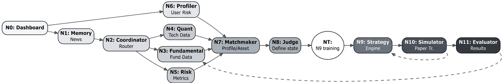

## Architecture Explanation

The overall system is organized around the following conceptual blocks:

- **Interactive Interface:** A Gradio--based front--end used to present the analytical flow and the final outputs to the user.
- **Graph / Orchestration Layer:** A coordination structure that routes information across the different modules and consolidates their outputs.
- **FINCON--Style Parallel Agents:** A parallel organization of specialized analytical agents responsible for profiling, evaluation, risk interpretation, recommendation reasoning, and complementary financial analysis.
- **FINMEM--Inspired Memory Structure:** An adaptive memory layer designed to retain selected historical context and improve continuity across analytical cycles.
- **MDP Decision Layer:** A Markov Decision Process component designed to support structured investment interpretation through state--based decision modeling.

## Key Design Principles

The project was guided by several technical and presentation principles:

- **Modularity:** Each analytical responsibility is isolated in a separate component.
- **Explainability:** Outputs are designed to be interpretable rather than opaque.
- **Parallel reasoning:** A FINCON--style agent structure enables multiple analytical perspectives to be processed in parallel.
- **Structured memory:** A FINMEM--inspired memory design supports continuity and context retention across analytical iterations.
- **Structured decision--making:** The MDP layer introduces a formal mechanism for organizing the final decision process.
- **Scalability of reasoning:** New analytical blocks can be incorporated without redesigning the whole system.
- **User--centered presentation:** The dashboard is intended to make complex information readable and structured.
- **Separation of public and private layers:** The public repository documents the work without exposing the sensitive implementation details.

## Technology Stack

The private implementation of the project is based on a Python--centered workflow for agent coordination, financial analysis, decision support modeling, memory organization, and interface rendering. The public repository focuses on the conceptual presentation of the system rather than on shipping the underlying source code.

Main technologies and concepts used in the project include:

- Python
- Gradio
- Multi--agent reasoning
- Graph--based workflow orchestration
- FINMEM--inspired adaptive memory design
- FINCON--style parallel agent organization
- Markov Decision Process (MDP) modeling
- Financial analytics and recommendation support
- Version control with Git and GitHub

## Dashboard Gallery

The following images present selected views of the `gradio_app` interface.

### Dashboard View
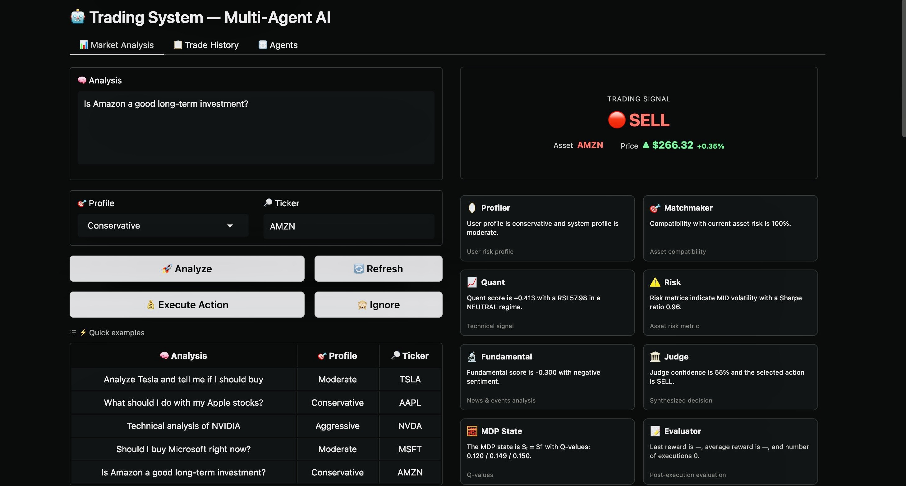
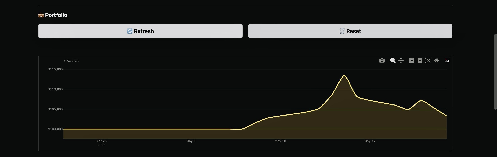
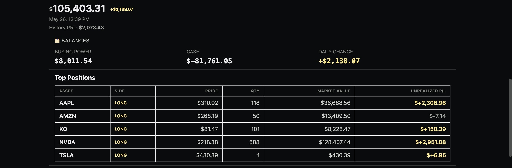
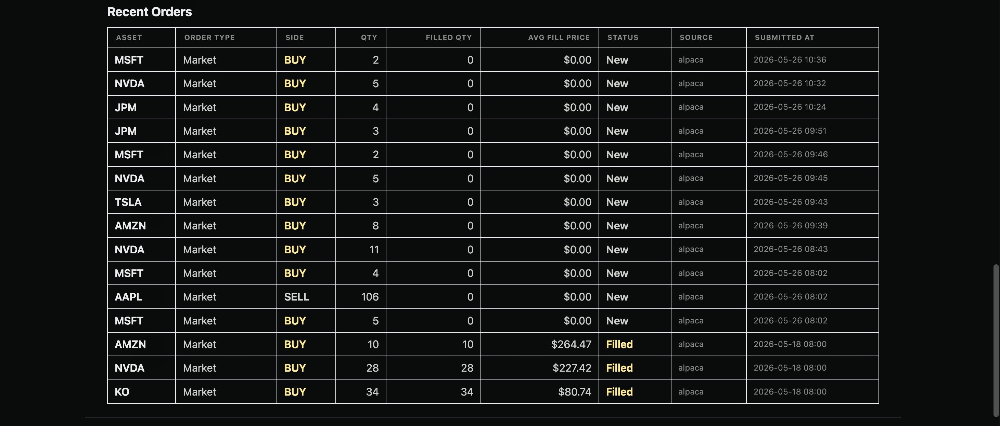
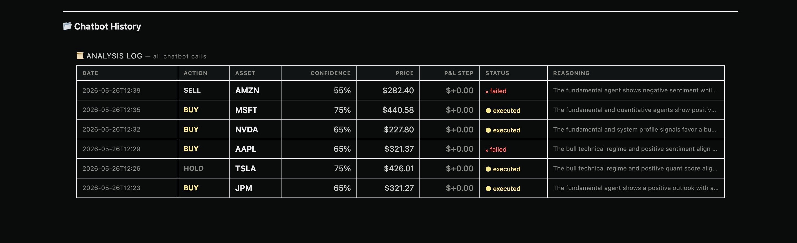
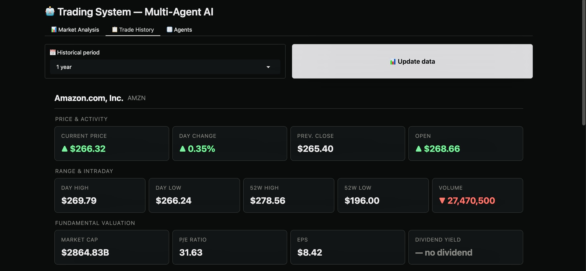
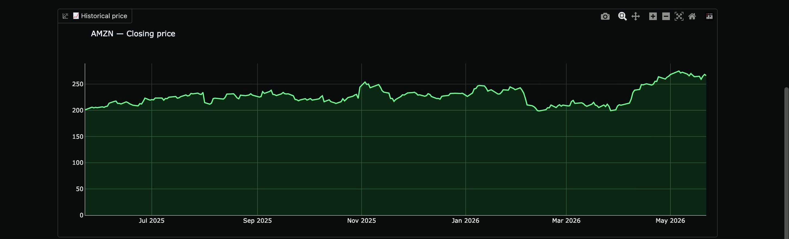
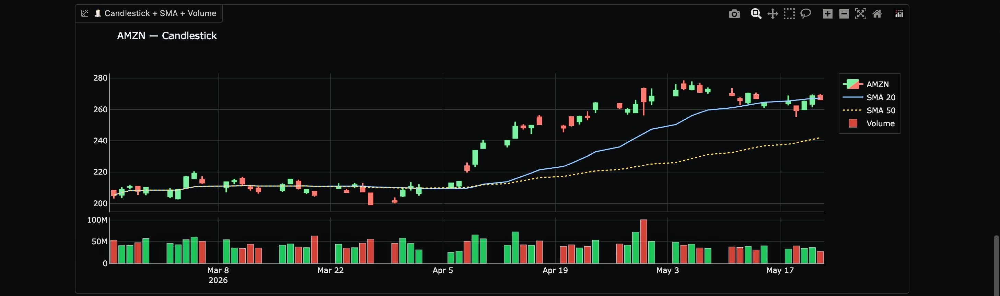
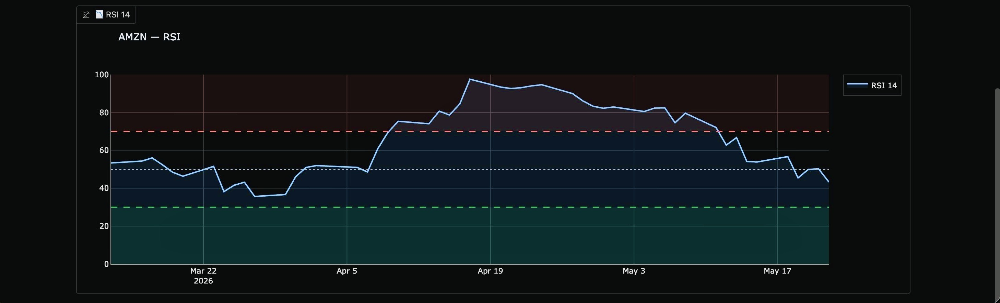
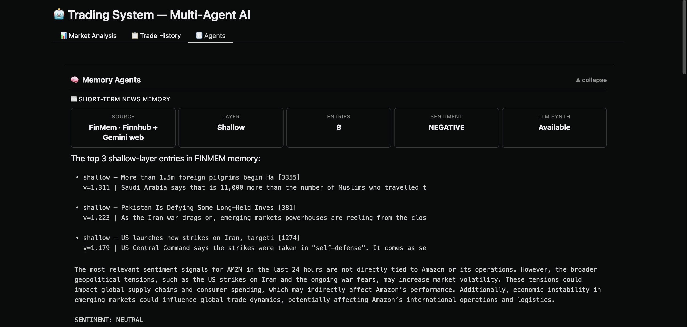
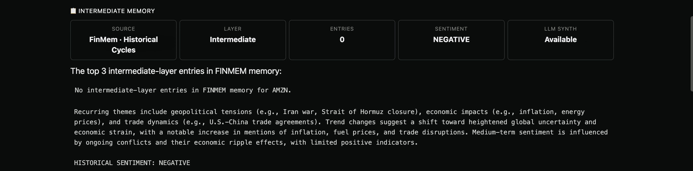
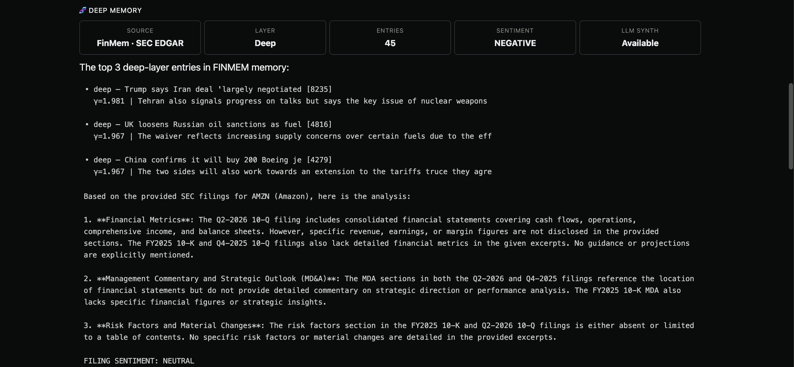
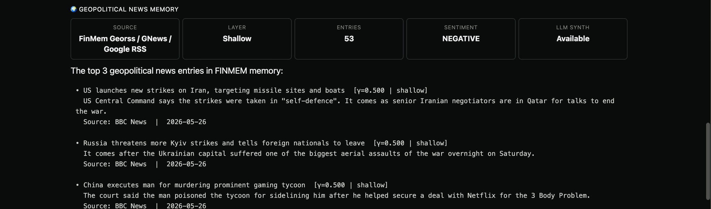
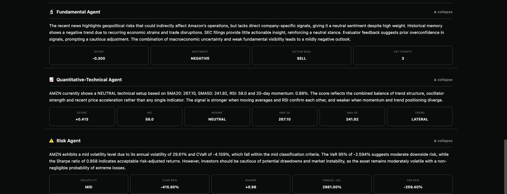
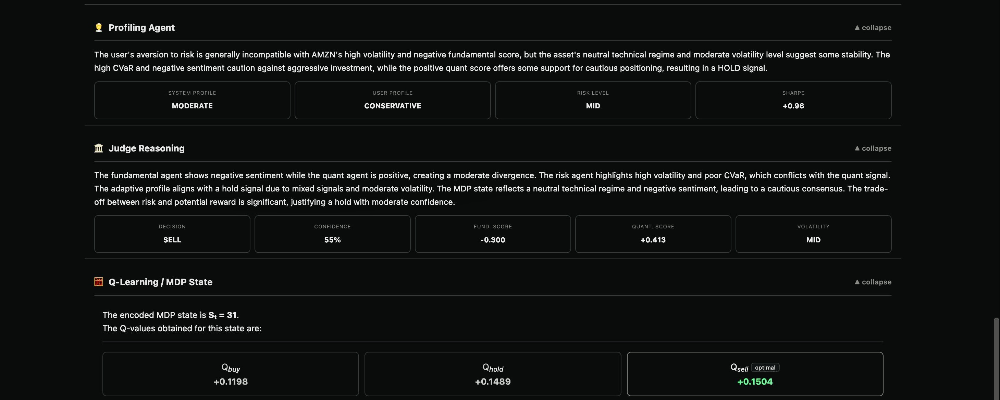
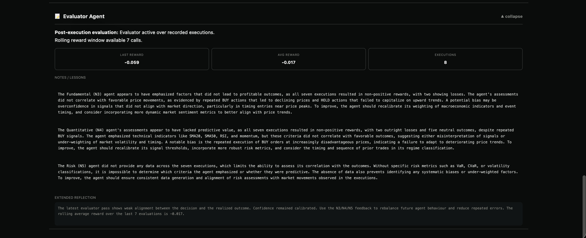

## What This Repository Includes

This public version is intended as a professional showcase of the project. It is designed to communicate the quality of the work, the structure of the system, and the visual interface without publishing the private implementation.

This repository may include:

- High--level project description
- Architecture overview
- Interface screenshots
- Conceptual explanation of the analytical workflow
- Public documentation for academic or portfolio purposes

## What This Repository Does Not Include

To preserve the private implementation and the most sensitive technical assets, this repository does not expose:

- The full source code
- Internal agent logic
- Memory files or generated histories
- Private execution workflows
- Deployment credentials or operational configuration
- Proprietary implementation details of the decision pipeline

## Repository Purpose

This repository is intended to document the ideas, architecture, and interface design of the project in a portfolio--friendly format. It functions as a public--facing technical presentation of the work rather than as a distributable software package.

## License

This repository is shared for presentation and academic portfolio purposes. Review the `LICENSE` file for the applicable usage terms.
